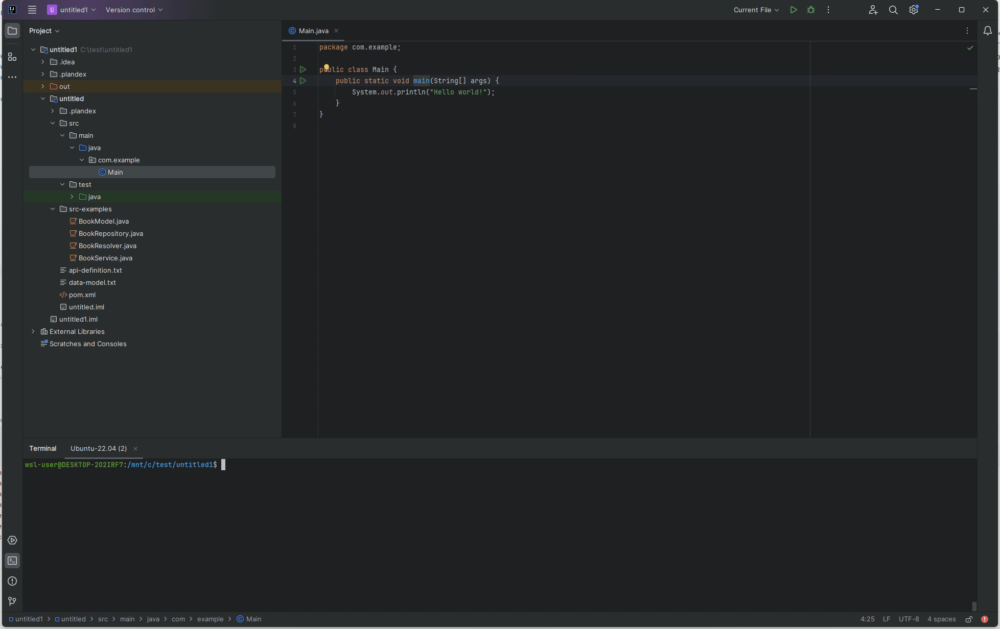

# Plandex Intellij Plugin

## Features

- **Project Explorer**
  - **Add selection to context**: Add selected files or directories to the Plandex context.
  - **Remove selection from context**: Remove selected files or directories from the Plandex context.
- **Editor**
  - **Add class to context**: Add the selected class to the Plandex context.
  - **Add test for this method**: Generate a test for the selected method.
  - **Make a change to this method**: Make a change to the selected method.
- **Test Result**
  - **Fix test**: Automatically fix failing tests.
- **Build Results**
  - **Fix compiler errors**: Automatically fix compiler errors.

To use these features, right-click on the desired file, class, or method in the Project View or Editor, and select the appropriate action from the `Plandex` menu.

## Requirements

- A working Plandex CLI installation

## Installation

To install the Plandex plugin, follow these steps:

1. Download the newest Version from GitHub Releases
2. Open IntelliJ IDEA.
3. Go to `File` > `Settings` (or `IntelliJ IDEA` > `Preferences` on macOS).
4. Click on install plugin from disk and select the downloaded zip

## Contributing

We welcome contributions to the Plandex plugin! If you would like to contribute, please follow these steps:

1. Fork the repository on GitHub.
2. Create a new branch with a descriptive name.
3. Make your changes and commit them with clear and concise commit messages.
4. Push your changes to your forked repository.
5. Create a pull request for the main repository.

Please ensure that your code adheres to the project's coding standards and includes appropriate tests.

## License

This project is licensed under the MIT License.
